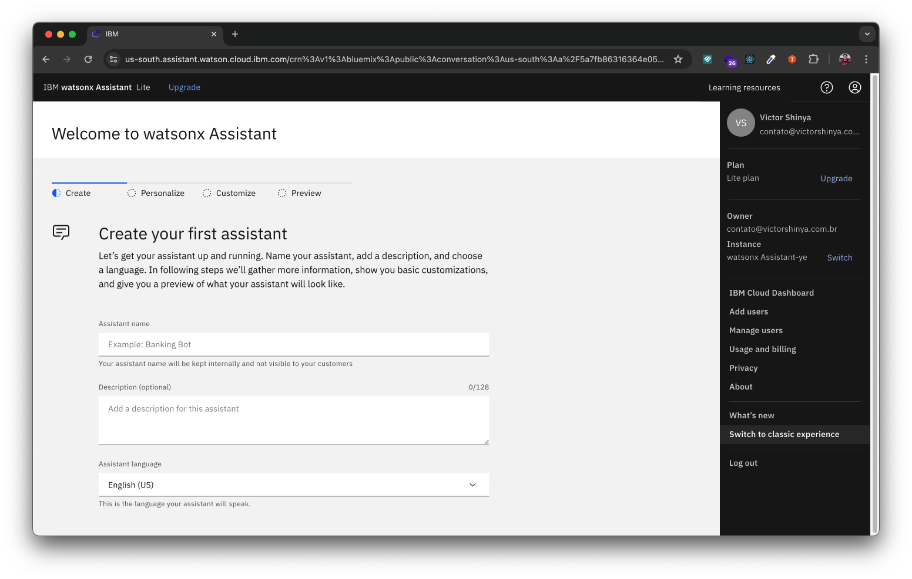

# IBM watsonx Assistant Workshop

IBM watsonx Assistant é uma plataforma de inteligência artificial conversacional desenhada para ajudar a sobrepor a fricção do suporte tradicional e a entrega de experiência excepcional.

Guia:

- [Experiência clássica](#experiência-clássica)
- [Actions](#actions)

## Experiência clássica

A experiência clássica é a maneira mais usada por empresas e desenvolvedores para treinar o modelo do seu chatbot ou assistente virtual. Nesta forma, você irá trabalhar com a estrutura **Intent**, **Entity** e **Dialog**.

Para mudar, é necessário clicar no ícone do usuário (canto superior direito da tela) e clicar na opção "**Switch to new experience**".

- Chatbot de exemplo: [Pizzaria-do-Seu-Zé-dialog.json](content/Pizzaria-do-Seu-Zé-dialog.json)

## Actions
*Em construção*

## License
Copyright 2024 Victor Shinya

Licensed under the Apache License, Version 2.0 (the "License");
you may not use this file except in compliance with the License.
You may obtain a copy of the License at

    http://www.apache.org/licenses/LICENSE-2.0

Unless required by applicable law or agreed to in writing, software
distributed under the License is distributed on an "AS IS" BASIS,
WITHOUT WARRANTIES OR CONDITIONS OF ANY KIND, either express or implied.
See the License for the specific language governing permissions and
limitations under the License.