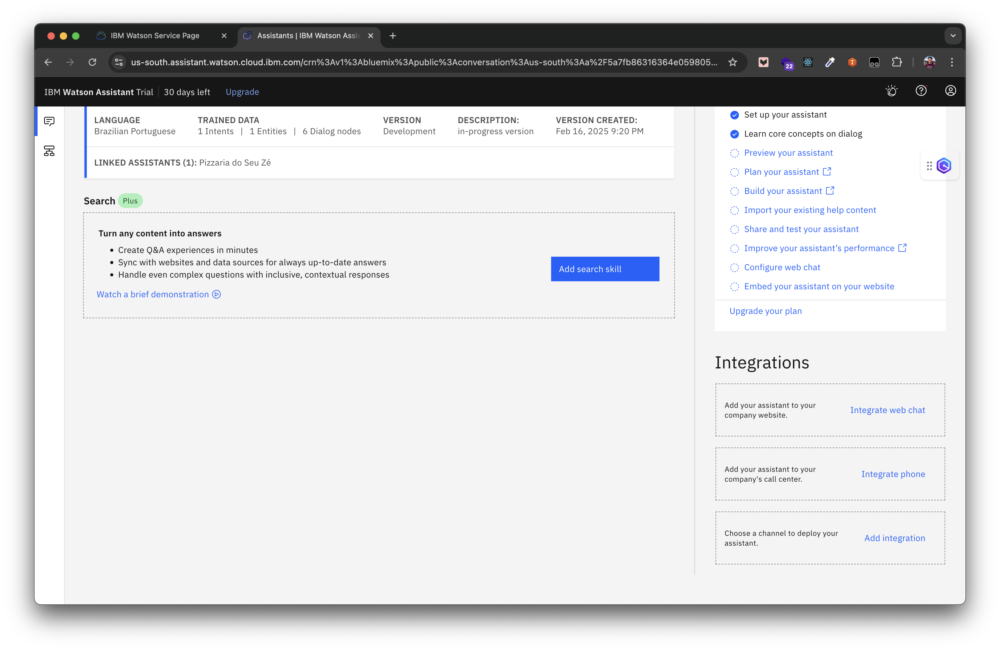

# IBM watsonx Assistant Workshop

IBM watsonx Assistant é uma plataforma de inteligência artificial conversacional desenhada para ajudar a sobrepor a fricção do suporte tradicional e a entrega de experiência excepcional.

### Guia:

- [Criação de uma conta](#criar-uma-conta-gratuita-na-ibm-cloud---parceria-acadêmica-ibm--universidades)
- [Experiência clássica no IBM Watson Assistant](#experiência-clássica-no-ibm-watson-assistant)
- [Experiência nova no IBM watsonx Assistant](#experiência-nova-no-ibm-watsonx-assistant)

## Criar uma conta gratuita na IBM Cloud - parceria acadêmica IBM & Universidades

A IBM Cloud requer um cartão de crédito para a criação de uma nova conta. O cartão de crédito serve para identificar o usuário e evitar fraúdes no uso da plataforma de nuvem pública. Para estudantes de faculdade e universidades, a IBM possui um programa de parceria que permite a criação de novas contas sem a necessidade de cartão de crédito.

A IBM possui parceria com diversas faculdades e universidades no Brasil. Caso a sua faculdade ou universidade possua esta parceria, você pode ter acesso a benefícios, incluindo um cupom (IBM Cloud Feature Code) para criar uma conta na IBM Cloud sem a necessidade de cartão de crédito. Caso queira verificar a parceria, acesse o [IBM SkillsBuild Software Downloads](https://academic.ibm.com/a2mt/email-auth#/) com o seu email da faculdade/universidade (ex: `rm00000@fiap.com.br`). Você recerá um erro caso a sua faculdade/universidade não possua uma parceria estabelecida com a IBM. Veja os benefícios do programa no site [IBM SkillsBuild](https://skillsbuild.org/college-students)

- [Como solicitar um IBM Cloud Feature Code](https://github.com/academic-initiative/documentation/blob/main/academic-initiative/how-to/How-to-request-and-IBM-Cloud-Feature-Code/readme.md)
- [Como criar uma conta na IBM Cloud](https://github.com/academic-initiative/documentation/blob/main/academic-initiative/how-to/How-to-create-an-IBM-Cloud-account/readme.md)
- [FAQs - IBM SkillsBuild Software Downloads](https://academic.ibm.com/a2mt/faq#/)

## Experiência clássica no IBM Watson Assistant

Após a criação da sua nova conta IBM Cloud, você acessará a plataforma e entrará na sua conta — lembre-se do e-mail e da senha que você digitou ao criar a nova conta. Ao logar com a sua conta, você encontrará a página de Dashboard. Nesta página, você tem acesso as principais informações como recomendações de serviços, notícias (incluindo postagens no blog da IBM Cloud), tickets abertos no suporte, manutenções programadas que impactarão algum serviço provisionado em sua conta (informação importante para planejar e notificar seus clientes e usuários), status das regiões da IBM Cloud (também conhecidos como Multizone Region), gastos e acesso para novos usuários na plataforma. Além dessas opções, você consegue editar o Dashboard para adicionar outros painéis e reorganizar os painéis existentes.

Para provisionar qualquer serviço, você deve acessar o catálogo da plataforma, para visualizar todos os serviços disponíveis e realizar a atividade de provisionamento do determinado serviço. Esta ação faz com que você tenha uma “cópia” do serviço em sua conta e é com esta ação que permite que você possa configurar para atender a sua necessidade. Um exemplo que iremos utilizar é com o serviço do watsonx Assistant. Você provisionará uma instância (termo utilizado para se referir a “cópia”) e vai criar um novo chatbot com uma base de treinamento próprio.  

Para acessar o catálogo, você tem duas opções. A primeira é clicar no botão de “Catalog” no menu superior. A segunda opção, e mais óbvia, é clicar no botão azul de “Create resource”, no canto superior direito da tela e próximo da foto do seu perfil.

Dentro da página de catálogo, você pode buscar pelo serviço “watsonx Assistant” na barra de pesquisa, logo abaixo da palavra “Catalog”. A primeira opção que irá aparecer, será o serviço que iremos trabalhar. É possível filtrar pela categoria “AI / Machine Learning” para aparecer apenas os serviços e softwares de Inteligência Artificial e Machine Learning. O primeiro item que aparecerá nessa lista é o watsonx Assistant. Basta clicar em cima do retângulo do serviço para ver mais detalhes do serviço e para provisionar na sua conta.  

Na página de detalhes e provisionamento do serviço, para o nosso caso, não há necessidade de mudar nenhuma informação, já que você provisionará uma instância na região de Dallas (us-south), utilizará o plano gratuito e não fará nenhuma modificação de nome da instância ou tags. Caso tenha interesse, navegue pela página para ler mais detalhes dos demais planos (todos pagos) do serviço do watsonx Assistant. Cada plano inclui uma funcionalidade melhor do que a instância anterior e costuma atender um perfil de empresas diferente. Um exemplo prático é o plano “Enterprise with data isolation” onde o cliente mantem os seus dados de uso e de treino em uma instância isolada e dedicada à aquele cliente. Empresas do setor financeiro ou governamentais costumam necessitar este tipo de isolamento dos dados para garantir maior controle sobre a privacidade dos dados.

Como não será necessário alterar nenhuma opção na página de provisionamento do serviço, clique no botão azul de “Create” para provisionar uma nova instância do serviço na sua conta. Este procedimento leva poucos segundos para concluir e logo, na sequencia, você é redirecionado automaticamente para a página de detalhes da sua instância do serviço.

Na página de detalhes da sua instância do serviço do watsonx Assistant, você tem acesso a a plataforma de treinamento do chatbot, a credencial (chave de API para realizar o acesso via API ou SDK), a visão do plano atual e documentação de como começar e das APIs disponíveis no serviço. Além disso, você consegue, no menu canto esquerdo, criar mais credenciais ou trocar o plano da sua instância. Para realizar a criação de um chatbot e treiná-lo, é necessário entrar na plataforma de treinamento. Para isso, clique no botão azul de “Launch watsonx Assistant”.

Na primeira vez que você acessar a plataforma de treinamento, logo após o provisionamento de uma nova instância do serviço, você cairá na página de “Welcome” e será induzido a criar um assistente (assistant). Este assistente utiliza funcionalidades que são provenientes da nova experiência do watsonx Assistant. A grande maioria das empresas utilizam a estrutura clássica e mais conhecida, que oferece a estrutura tradicional de intenção, entidade e diálogo, comumente adotada nas empresas. Você pode seguir a construção e treinamento com esta nova experiência, mas o passo a passo que você verá nesta aula será focado na experiência clássica, que é a mais utilizada pelas empresas.

Para mudar para a experiência clássica, você precisa clicar no ícone do usuário, no canto superior direito, e clicar na opção “Switch to classic experience”. A plataforma vai solicitar confirmação da mudança e você clicará no botão azul de “Switch”. Você pode mudar para a nova experiência a qualquer momento, apenas realizando o mesmo procedimento e clicando na opção “Switch to new experience".

Em algumas situações, ao clicar na opção “Switch to classic experience”, a plataforma abrirá um pop-up e apresentará motivos para continuar na experiência nova no watsonx Assistant. Desça todo o pop-up e clique para confirmar a mudança para a experiência clássica. Depois escolha qualquer uma das opções como motivo da mudança e confirme a mudança mais uma vez. Dessa forma, você conseguirá mudar para a experiência clássica.

Agora, dentro da ferramenta de treinamento, você consegue enxergar dois itens no menu na lateral esquerda: Skills e Assistants.

- **Skills** é a base de conhecimento do seu chatbot. Em um chatbot de atendimento, por exemplo, a Skill será o local onde você realizará o treinamento do seu chatbot, incluindo frases para ensiná-lo a entender a mensagem dos usuários e também onde você configurará as respostas dele. Nos projetos dentro das empresas, é onde você implementará todo o conhecimento do negócio e da indústria.
- **Assistants** é dado como o conjunto de Skills, no qual você agrupa as bases de conhecimento em um único assistente. Você dá ao assistente virtual uma ou mais habilidades para poder lidar com os diversos cenários do seu cliente.

Se formos separar os dois itens, podemos considerar que o Skill é o local de treinamento do chatbot, e o Assistant é a forma de unir as Skills e integrar nos canais de comunicação — e isso inclui a página Web tanto na opção de um script pronto para colocar no HTML do seu site como a opção de ter um link de um chat para compartilhar com seus conhecidos para testar o conteúdo publicamente.

Na página inicial do watsonx Assistant, com a experiência clássica, você vai clicar no botão cinza de “Create assistant” para criar o assistente (assistant) que será utilizado para adicionar um novo Dialog Skill e será disponibilizado através de uma página na web. Na página de criação de um novo assistente, você deve colocar o “Name” como “Pizzaria” (ou “Pizzaria do Seu Zé” como no meu modelo). Você pode deixar o campo “Description” vazio. O nome e a descrição do seu assistente servem apenas para localização. A principal função de ambos os campos é para que os profissionais que acessam a plataforma de treinamento do watsonx Assistant possam identificar qual ou quais assistentes existem dentro daquela determinada instância.

Uma vez preenchido, você pode clicar no botão azul de “Create assistant”. Em milissegundos, o watsonx Assistant criará o seu assistente.

Uma vez criado, o assistente (assistant) pode integrar com um Action Skill ou Dialog Skill, e um Search Skill. Nesta aula, iremos utilizar o Dialog Skill, que trabalha com o modelo de intenção, entidade e diálogo. Clique no botão azul de “Add dialog skill” para criar a base de treinamento do seu assistante (assistant).

- **Actions Skill**: Oferece uma interface simples onde qualquer profissional pode construir um fluxo conversacional para o seu assistente seguir. O complexo processo de criação de dados de treinamento ocorre atrás das cenas automaticamente.
- **Dialog Skill**: Oferece um conjunto de editores para que você use para definir ambos os seus dados de treinamento e a conversa. A conversa é representada como uma árvore de diálogo. Você usa o editor de diálogo gráfico para criar uma espécie de script para o seu assistente ler quando ele interage com seus clientes. A caixa de diálogo identifica os objetivos comuns do cliente que você ensina a reconhecer e fornece respostas úteis.
- **Search Skill**: Alavanque informações de bases de conhecimento corporativo existentes ou outras coleçoes de conteúdo de autoria de especialistas no assunto para atender a consultas de clientes imprevistas ou mais sutis. Para uma determinada consulta do usuário, usa o serviço IBM Watson Discovery para procurar uma fonte de dados de seu conteúdo de autoatendimento e retornar uma resposta.

Na página de criação de um novo Dialog Skill, você visualizará uma página de configuração geral da Dialog Skill. Nessa página, você pode criar uma Skill a partir de três formas diferentes: Create skill, Use sample skill e Upload skill.

- **Create skill**: você criará um Dialog Skill do zero. Esta é a opção que você utilizará com maior frequência nos novos projetos dentro da empresa.
- **Use sample skill**: você pode usar um chatbot de exemplo, de serviço de atendimento ao consumidor (“Customer Care Sample Skill”), disponível na lista. É um ótimo exemplo para aprender uma estrutura simples de um chatbot, com algumas funcionalidades implementadas, como Jump to e Skip user input na área de diálogo (na árvore de decisão).
- **Upload skill**: você pode importar uma Skill já criada a partir de um arquivo JSON. Esse arquivo JSON é gerado ao criar uma nova Skill e é atualizado toda vez que você faz alguma alteração na Skill Normalmente, você utiliza essa opção quando vai movimentar uma Skill de uma instância de watsonx Assistant para outra, que pode ser por conta de uma atualização do seu ambiente produtivo, a partir do ambiente de testes ou quando você precisa resgatar uma versão antiga que está armazenada em um sistema de controle de versionamento, como Github ou Bitbucket.

Para este laboratório prático, você criará um chatbot de pizzaria. Esse é um exemplo do nosso cotidiano que mais utiliza as mesmas frases e que apenas varia de acordo com a região, o estado e a cidade do Brasil. E mesmo com essa variação na maneira de fazer o seu pedido na pizzaria, é possível criar um chatbot que compreenda todas as formas de fazer um pedido, por exemplo, para não perder a identidade de cada estabelecimento e ainda atender à demanda dos usuários.

Mesmo com o crescimento dos aplicativos de pedido de comida, ainda é muito comum encontrarmos pizzarias de bairro que não estão presentes nesses aplicativos. Além de ser uma oportunidade de negócio com chatbot, é uma forma de criar uma visão nos negócios que são do nosso dia a dia, e repetitivos, iguais (ou similares) a uma pizzaria.

No watsonx Assistant, para criar um novo Dialog Skill, você precisa obrigatoriamente definir dois campos: "Name” e “Language”. O nome será para a identificação e a linguagem é para que o watsonx Assistant saiba qual linguagem será utilizada na interação entre o seu chatbot e o usuário. Opcionalmente, você pode escrever no campo descrição, que pode servir para dar mais detalhes daquilo que está sendo treinado nessa Skill.

Para o laboratório, você pode dar um nome como “Pizzaria” — já que se trata de um chatbot de pizzaria — e deve selecionar a linguagem “Brazilian Portuguese”, ou português brasileiro. A escolha da linguagem é importante, pois é essa opção que faz com que o seu chatbot utilize o modelo daquela linguagem, especialmente nos mecanismos de Inteligência Artificial e aprendizado de máquina. Em chatbots menores, isso não faz tanta diferença, mas quando o chatbot começa a escalar e ganhar mais conteúdo e estrutura, esses mecanismos começam a “falhar” e resultam em péssimas experiências para o seu usuário. É possível alterar a linguagem posterior a sua criação direto no arquivo JSON, entretanto, o trabalho necessário para fazer essa troca será maior do que o de elaborar um novo Skill.

Escolha o “Skill Type” como “Dialog”. No watsonx Assistant existem duas opções: “Action” e “Dialog”.
A opção “Action” permite que você crie um assistente com foco no conteúdo. Benefícios de utilizar “Action”:
•	O processo de criação de um fluxo de conversação é mais fácil. Pessoas com experiência em atendimento ao cliente podem escrever as palavras que seu assistente diz. Com um processo simplificado, qualquer pessoa pode criar uma conversa. Você não precisa de conhecimento sobre aprendizado de máquina ou programação.

- As ações fornecem melhor visibilidade da interação e satisfação do cliente com o assistente. Como cada tarefa é discreta e tem um começo e fim claros, você pode rastrear o progresso do usuário por meio de uma tarefa e identificar problemas.
- O designer de conversação não precisa gerenciar dados coletados durante a conversa. Por padrão, seu assistente coleta e armazena informações durante a ação atual. Você não precisa tomar medidas extras para excluir dados salvos ou redefinir a conversa. Mas se quiser, você pode armazenar certos tipos de informações, como o nome do cliente, durante a conversa.
- Muitas pessoas podem trabalhar ao mesmo tempo em ações separadas e independentes. A ordem das ações em uma conversa não importa. Apenas a ordem das etapas em uma ação importa. E o autor da ação pode usar arrastar e soltar para reorganizar as etapas na ação para um fluxo ideal.

A opção “Dialog” permite maior controle sobre a lógica do fluxo de conversação. O editor de diálogo expõe mais artefatos (como intenções e entidades) usados para construir os modelos de IA. O fluxo de diálogo usa uma estrutura de estilo “if-then-else” que pode ser familiar para desenvolvedores, mas não para designers de conteúdo ou especialistas em atendimento ao cliente.

A opção “Action” foi oficialmente lançada em 2022. Todos os projetos desenvolvidos e treinados até este ano, utilizou a opção de “Dialog”. Logo, o modelo mais difundido nas empresas é com a opção de “Dialog”. Com o advento da Inteligência Artificial Generativa, o modelo de “Action” será o mais recomendado. Toda a estrutura padrão de atendimento será respondida pelo watsonx Assistant e, quando não reconhecer, o watsonx Assistant redicionará a mensagem para o watsonx.ai para responder com um modelo de fundação (ou Foundation Model, em inglês).

Escolha a opção “Dialog”. Depois de definir os campos, clique no botão azul “Create skill”.

Após a criação, você será direcionado de volta para o Assistant. Clique no retângulo do seu novo Dialog Pizzaria.

Você entrará na sua Skill para iniciar o treinamento. A partir disso, você treinará três itens importantes: Intenção, Entidade e Diálogo. Costumamos definir esses três itens como “Os três pilares do watsonx Assistant”: isso porque, sem eles, não há como ter um chatbot. Para você conhecer um pouco melhor os três pilares, veja abaixo um resumo de cada um:

- Intenção (ou Intent): considerado como propósito, objetivo. Você deve analisar a frase dos usuários com o objetivo de entender “Qual é o propósito dele(a) ao fazer essa pergunta?”. Aqui é onde você agrupa exemplos de frases a fim de poder analisar uma frase, não pelas palavras-chave, mas pelo contexto. No contexto de pizzaria, duas pessoas podem pedir pizza, por exemplo, de maneiras diferentes. A partir disso, você colocará os dois exemplos em uma mesma intenção para mapear formas diferentes de pedir pizza e ensinar o watsonx Assistant a entender que são formas diferentes para alcançar o mesmo objetivo.
- Entidade (ou Entity): considerado como complemento da informação. É usado para diferenciar uma frase da outra. O mesmo usuário pode mandar duas mensagens, com a mesma intenção, com algo que diferencie uma frase da outra. Esse algo pode ser uma entidade. No contexto de pizzaria, uma entidade pode ser o sabor de uma pizza. A mesma pessoa pode pedir uma pizza em momentos diferentes e o sabor pode ser diferente. A entidade de sabor é o que diferenciará o custo de uma pizza para outra, por isso é necessário utilizar esse item.
- Diálogo (ou Dialog): é nesse ponto que você cria toda a árvore de decisão do watsonx Assistant. Você une a intenção com a entidade (se houver) e cria-se todo o fluxo de diálogo.

Logo na tela inicial, você já consegue treinar o primeiro pilar: a Intenção. Para isso, você pode fazer de três formas diferentes: adicionar nova intenção a partir do botão azul “Create intent”, usar exemplos do catálogo de conteúdo, na aba “Content Catalog”, ou importar um arquivo CSV a partir do botão “Upload intents”. No dia a dia da empresa, é bastante comum os curadores de chatbot gerirem o conteúdo em uma planilha Excel para, depois, exportar o formato em CSV e importar no watsonx Assistant, pela praticidade e velocidade. Aqui, como instrumento de estudo, você utilizará a própria ferramenta de treinamento para criar o seu primeiro chatbot. Será uma etapa importante para explicar, com mais detalhes, como funciona o treinamento.

Clique no botão azul “Create intent”. Repare que, no primeiro campo, aparece um # (hashtag ou cerquilha). As intenções serão representadas com uma # seguida do nome definido, enquanto as entidades serão representadas com um @ (arroba) seguido do nome definido. Isso facilitará a identificação do que é cada um quando for configurar o diálogo.

Agora, dê o nome da intenção de “fazer_pedido”, clique no botão azul “Create intent” (ou aperte a tecla Enter) e defina pelo menos 5 exemplos — número recomendável para se criar um modelo de intenção minimamente funcional. Os exemplos que você deve inserir são frases que os usuários utilizam na vida real. Ou seja, você pega exatamente como as pessoas falam e insere na ferramenta para que o watsonx Assistant busque entender a forma como as pessoas falam e escrevem para representar aquela intenção — de certa forma, é uma digitalização de uma experiência da vida real, mas com a escalabilidade para atender a demanda de mais pessoas. Essas frases de exemplos são usadas para treinar o modelo da intenção de sua Skill.

Insira uma frase de cada vez e clique no botão azul “Add example” (ou aperte a tecla Enter) para adicionar na lista de exemplo. Ao inserir cada exemplo, você treinará o modelo da sua Skill. Esse processo ocorre por debaixo do serviço. Você pode utilizar as seguintes frases de exemplo para configurar a sua intenção #fazer_pedido (Figura “Treinamento da intenção (intents)”):

- “Desce uma pizza de mussarela”.
- “Eu gostaria de fazer o meu pedido”.
- “Manda uma pizza de calabresa”.
- “Me vê uma pizza”.
- “Quero fazer o meu pedido”.

Após adicionar os 5 exemplos (ou mais), clique na seta azul, no canto superior esquerdo, para voltar para a lista de intenções. Agora, clique na aba “Entities” para acessar as entidades. Aqui é possível você criar a sua própria entidade a partir do botão azul “Create entity” ou importar um arquivo CSV a partir do botão “Upload entities”. Da mesma forma que é feita com as intenções, as entidades também podem ser criadas a partir de um arquivo CSV, é o meio mais utilizado pelas empresas em chatbots mais robustos. Além disso, você consegue usar entidades predefinidas pela IBM, chamada de “System entities”. Segue, abaixo, algumas entidades de sistemas disponíveis em língua portuguesa:

- **@sys-time**: reconhece tempo no formato tradicional e em outros formatos mais usuais dentro de uma conversa. Exemplos: 20:59, 10 da manhã, em 10 minutos, agora, daqui a 1 hora.
- **@sys-date**: reconhece datas no formato tradicional e em outros formatos mais usuais dentro de uma conversa. Exemplos: 12/12/2018, 7 de setembro, hoje, amanhã, agora, na próxima sexta.
- **@sys-percentage**: reconhece valores com o símbolo de % (porcentagem) ou escrito — porcentagem. Exemplos: 50%, 90 por cento.
- **@sys-currency**: reconhece valores monetários na frase informada pelo usuário. Exemplos: 20 centavos, 50 reais, R$ 75,00.
- **@sys-number**: reconhece números como dígitos e escritos. Exemplos: 21, vinte e um.

Aqui, criaremos a nossa própria entidade. Para isso, clique no botão azul “Create entity” e defina o nome de “sabor” — que será o nosso complemento da informação. Ao fazer um novo pedido, o usuário deverá informar o sabor da pizza.

Diferentemente das intenções, as entidades trabalham em um modelo, um pouco diferente, de dados para treinamento. A estrutura de inserir exemplos é mantida, porém você insere valores e seus sinônimos ou expressão regular. Usamos sinônimos para ensinar variações daquela mesma palavra — por questões de variações regionais e variações até errôneas para trabalhar a informalidade — e usamos expressões regulares para ensinar um padrão ao invés de ensinar diversas variações com a mesma estrutura, como CEP, CPF e outros. No caso da pizzaria, criaremos uma entidade de sabor e os valores da entidade com seus sinônimos, como calabresa, muçarela e portuguesa.

Assim como você fez na intenção, na entidade, você digitará o nome da entidade de “sabor” e clicará no botão azul “Create entity” (ou apertar a tecla Enter). No campo de valor, você inserirá os seguintes dados:

- Valor: "calabresa". Sinônimo: "linguiça" e "calabreza".
- Valor: "muçarela". Sinônimo: "queijo" e "mussarela".
- Valor: "portuguesa". Sinônimo: "portuga" e "lusa".

Definida a entidade de sabor, clique na seta azul, no canto superior esquerdo, e volte para a tela com a lista das entidades.

Agora que temos a nossa intenção #fazer_pedido e a entidade @sabor, chegou a hora de construir o fluxo de diálogo na próxima aba, de “Dialog”. Na área de diálogo, você verá dois retângulos, um embaixo do outro, de “Bem-vindo” e de “Em outros casos”. No watsonx Assistant, chamamos esse retângulo de nó de Diálogo (ou Dialog Node). Quando um usuário faz uma pergunta e ela passa por cada nó até achar um nó de cima para baixo, até achar um que seja compatível com a frase enviada pelo usuário.

É dado o match com o nó de “Bem-vindo” com a primeira interação do usuário no primeiro contato com o chatbot. E é dado match com o nó de “Em outros casos” quando o chatbot não souber identificar a pergunta do usuário em uma das intenções ou entidades criadas. O nó de “Em outros casos” sempre deverá ser o último nó da sua árvore de decisão.

Crie um nó entre ambos os nós iniciais — caso não saiba, basta clicar sobre o botão de três bolinhas do nó de “Bem-vindo” e clicar na opção “Add node below”. Defina o campo “If assistant recognizes” com a intenção #fazer_pedido. Assim, toda vez que o watsonx Assistant reconhecer que o usuário quer fazer um pedido, ele cairá nesse nó. É possível adicionar outros valores, como outras intenções ou entidades. Caso você não queira digitar, basta clicar sobre o campo que você verá uma lista de opções. Basta clicar sobre as opções que você quer e o campo será preenchido automaticamente.

Logo abaixo você verá o campo "Assistant responds" e "Then assistant should". O primeiro item você irá definir a resposta para o usuário. Neste campo é possível usar textos, criar um menu de opções, dar uma pausa, enviar uma imagem, transferir para um atendente humano ou transferir para um outro canal de atendimento. No campo de texto, você consegue definir uma ou mais frases que podem ser apresentadas, individualmente, de forma sequencial, randômica ou múltiplas linhas (apresenta todas as respostas em balões diferentes, tudo de uma vez). E o segundo item é usado para definir se o chatbot deve esperar o usuário responder ou se deve, automaticamente, pular para outro nó.

Clique no botão "Customize", no canto superior direito da caixa do seu nó. Uma caixa será aberta. Habilite somente o item "Slot" e clique no botão azul "Apply". Você estará habilitando a funcionalidade que permite que você peça um certo dado para o usuário e salve este dado como uma variável de contexto, sinalizado pelo símbolo $ (cifrão).

Assim que habilitar, você verá uma nova seção dentro do nó, chamado "Then check for". Inicialmente, é importante saber dos três campos iniciais para configurar um Slot. Assim como fizemos no campo "If assistant recognizes", o primeiro campo você deverá informar uma intenção, entidade ou variável de contexto. Definindo o primeiro campo, o segundo campo automaticamente será preenchido com o mesmo nome, apenas substituindo o # ou @ por $ (da variável de contexto). O último campo você deve configurar com uma pergunta no cenário de quando o usuário não fornecer nenhum dado. Preencha os campos com a entidade @sabor (Figura "Configuração do Slot de sabor").

No campo “Then check for”, preencha o primeiro campo de “Check for” com “@sabor”. Automaticamente o segundo campo de “Save it as” com “$sabor”. Você pode alterar este campo, se necessário. No terceiro campo de “If not present, ask”, preencha com a pergunta “Qual é o sabor da pizza?”. Caso o usuário não forneça um sabor válido, o chatbot irá enviar esta pergunta. Lembre-se de que a funcionalidade de Slots funciona como um loop. O usuário somente sairá quando fornecer corretamente todos os dados válidos para preencher os itens do Slot. Uma alternativa para permitir a saída do usuário é configurar outra funcionalidade do watsonx Assistant, chamado de Digression (ou Digressão). Não iremos abordar esta funcionalidade na aula, mas fica a sugestão para ler na documentação oficial do watsonx Assistant para entender os casos de usos do Digression.

Com os campos todos preenchidos, basta definir a resposta, ou mais de uma resposta, para o usuário. Nesse exemplo, deixamos apenas uma frase de “Ok! Anotei o seu pedido. Sua pizza de $sabor será entregue em até 40 minutos. Obrigado e boa noite!” Repare que foi usado o $sabor dentro do texto. Ao armazenar uma nova variável, é possível utilizá-la na resposta do watsonx Assistant para dar dinamisno na resposta.

Existem também outras funcionalidades mais complexas e alguns truques que você utiliza para ampliar as funcionalidades do seu chatbot. Caso você queira se aprofundar, poderá buscar pela documentação do serviço e por vídeos no YouTube.

Agora que você tem uma Skill elaborada e treinada, chegou a hora de criar um Assistant e gerar uma página na Web para compartilhar com outras pessoas.

Chegou a hora de testar a Skill treinada. Clique no botão branco do canto superior direito, “Try it”, para abrir o chat interno da ferramenta. Esse chat é feito para realizar todos os testes e não desconta do valor limite de mensagens por mês de qualquer plano do serviço do watsonx Assistant. Faça um teste pedindo uma pizza de queijo, por exemplo, e veja a sua resposta configurada no retorno da mensagem do watsonx Assistant (Figura “Teste de envio de mensagem para o seu chatbot”).

Pronto! Agora você possui uma Skill treinada, que entende algumas formas de solicitação de um novo pedido de pizza e entende alguns sabores! Esse foi o primeiro passo para aprender a criar um chatbot. A partir disso, é possível você expandir, treinando mais intenções e entidades, por exemplo, anotar o CEP do cliente com o uso de uma nova entidade e responder às mensagens de “Bom dia”, “Boa tarde” e “Boa noite” em uma nova intenção, assim como treinar para responder caso o usuário envie uma mensagem de agradecimento, sendo também uma nova intenção.

Existem também outras funcionalidades mais complexas e alguns truques que você utiliza para ampliar as funcionalidades do seu chatbot. Caso você queira se aprofundar, poderá buscar pela documentação do serviço e por vídeos no YouTube.

Agora que você tem uma Skill elaborada e treinada, chegou a hora de criar um Assistant e gerar uma página na Web para compartilhar com outras pessoas.

Volte para a tela inicial da ferramenta do watsonx Assistant, clicando no item “Assistants” no menu lateral esquerdo. 

Agora, é possível testar as integrações nos canais de comunicação. Para isso, basta clicar em uma das opções de integração no canto direito do seu Assistant. Algumas integrações poderão ser configuradas direto na plataforma e outras demandarão um trabalho de programação. Também não podemos descartar a integração com outras plataformas, além das plataformas listadas, como é o caso dos Smart Speakers como Google Home e Amazon Alexa. Porém, novamente, essas integrações demandarão um trabalho de programação para integrar o watsonx Assistant nesses canais de comunicação.

Atualmente existem 9 integrações no watsonx Assistant, disponíveis na aba Assistants. Além das integrações existentes, na documentação do watsonx Assistant, você encontra a documentação para integrar o seu assistente (assistant) com outros serviços externos, como service desk (Salesforce, Zendesk, Genesys Cloud, NICE inContact, Twilio Flex, Oracle B2C Service e service desk customizado) e telefone (Twilio Flex e Genesys Cloud).

- **Web chat**: A integração com web chat disponibiliza um widget customizável e seguro para adicionar em seu website. você pode configurar como e onde o widget do web chat aparecerá e você pode usar um tema alinhado com a sua marca e design do website. Se um cliente precisar de ajuda de uma pessoa, a integração com web chat pode transferir a conversa para um agente (atendente).
- **Phone**: A integração com telefone (phone) permite que seu assistante (assistant) converse com clientes pelo telefone usando os serviços IBM Watson Text to Speech (serviço de sintetização de voz) e Speech to Text (serviço de transcrição de áudio para texto). Se seu cliente pedir para conversar com uma pessoa, a integração por telefone pode transferir a ligação para um agente (atendente).
- **WhatsApp with Twilio**: Integre com o WhatsApp para que seu assistente possa trocar mensagens com seus clientes onde eles estão. A integração com WhatsApp cria uma conexão entre seu assistente (assistant) e o WhatsApp através do provedor de serviços Twilio. É nessário ter uma conta de mensageria e um número de telefone no Twilio. Lembre-se que o WhatsApp possui um rigoroso processo para que a plataforma possa revisar todos os negócios que querem interagir com clientes em sua rede. WhatsApp, empresa do grupo Meta, requer que você registre o seu negócio no diretório de negócio da Meta.
- **Slack**: A integração com o Slack permite que seu assistente (assistant) responda a perguntas que são feitas em mensagens diretas ou em canais onde o assistente é diretamente mencionado.
- **Facebook Messenger**: A integração com o Facebook Messenger permite que seu assistente (assistant) responda a mensagens em uma determinada página no Facebook.
- **SMS with Twilio**: Os clientes podem enviar mensagens de texto para o seu número de telefone disponibilizado pelo Twilio. Twilio usa um webhook para que você possa configurar para enviar uma requisição POST com a mensagem de texto no corpo da requisição (body) para o seu assistente (assistant). Cada resposta do assitente é enviado de volta para o Twilio para que possa ser convertido em uma mensagem SMS de saída para ser enviada para o cliente. A resposta é enviada para a API do Twilio para processamento. Você disponibiliza sua conta Twilio (Twilio account SID) e as informações do token de autenticação do projeto, que servem como sua credencial de acesso a API do Twilio.
- **Intercom**: Intercom é uma plataforma de mensageria de cliente para ajudar negócios a crescerem através do melhor relacionamento durante o ciclo de vida do cliente. O Intercom possui parceria com a IBM para adicionar um novo agente (agent) para o time de suporte do cliente, um assistente do watsonx Assistant. Você pode integrar seu assistente (assistant) com uma aplicação Intercom para permitir que a aplicação transmita conversas de usuário perfeitamente entre seu assistente e agentes humanos. Se você integrar seu assistente com o Intercom, a aplicação do Intercom se torna a aplicação que interage com seus clientes. Todas as interações com os usuários são iniciados e gerenciados pelo Intercom.
- **Custom application**: Se nenhuma integração existente atender a sua necessidade, você pode construir sua própria aplicação como a interface entre o seu assistente (assistant) e seus usuários. Exemplos de integrações customizadas: disponibilizar seu assistente no Google Home e na Amazon Alexa.
- **Voice Agent (Telephony)**: Ao adicionar a integração do Voice Agent ao seu assistente (assistant), você pode gerar automaticamente um número de telefone comercial que é conectado automaticamente ao seu assistente. Ou, se preferir, você pode conectar o assistente à sua infraestrutura existente configurando um SIP (Session Initiation Protocol) trunk existente. Um SIP trunk é equivalente a uma linha telefônica analógica, exceto que usa Voz sobre Protocolo de Internet (VoIP) para transmitir dados de voz e pode suportar várias chamadas simultâneas. O trunk pode se conectar à rede telefônica pública comutada (PSTN) ou à central privada (PBX) local de sua empresa. Se você optar por gerar um número de telefone gratuito para o seu assistente, um SIP trunk será fornecido automaticamente pelo IntelePeer. Você também pode optar por usar um tronco SIP existente de um provedor como IntelePeer, Genesys ou Twilio.
 

No caso da opção de “Integrate web chat”, você pode gerar um script em Javascript para inserir no HTML do seu site e utilizar a interface gráfica pronta da IBM para interagir com o seu chatbot. Ou você pode ver outras opções ao clicar no botão “Add integration”.

Clique no botão “Integrate web chat” para visualizar o seu chatbot dentro de um widget, pré-criado e customizado. 

Para testar em uma página pronta, sem precisar atualizar código ou subir um novo site, você pode selecionar a opção “Preview” e gerar um link para uma aplicação pronta com um chat no meio da tela; dessa forma, você pode compartilhar com seus amigos, colegas e familiares para que eles testem o seu chatbot (Figura “Página de Preview com o chatbot de pizzaria”).

Baixe e importe o chatbot construído no laboratório no seu IBM watsonx Assistant (experiência clássica):

- Chatbot de exemplo: [Pizzaria-do-Seu-Zé-dialog.json](content/Pizzaria-do-Seu-Zé-dialog.json)

## Experiência nova no IBM watsonx Assistant

Na página inicial do seu assistente, você verá um botão azul “Switch to new experience”. Clique no botão e depois clique novamente no botão azul na tela “Switch”. Você será redirecionado para a nova plataforma.

Caso não veja o botão azul inicial, para ser direcionado para a nova experiência, você pode clicar no ícone de pessoa no canto superior direito da tela. Você verá um menu com as informações de usuário e da sua instância do serviço do IBM watsonx Assistant. Nesse menu, você vai localizar o item “Switch to new experience”. Clique no item e confirme a mudança no botão azul “Switch”. Essas são as duas formas de mudar a experiência do serviço.

Na nova plataforma, você entrará na página de boas vindas. Na página, você preencherá os campos obrigatórios para criar o seu primeiro assistente. No nome do assistente, digite “Pizzaria do Seu Zé”. No menu de idioma ou linguagem do assistente, escolha a opção “Brazilian Portuguese”. A lógica é a mesma da experiência clássica. Para ter a melhor experiência da inteligência artificial, você precisa escolher o idioma que será utilizado para que o serviço utilize o modelo daquele idioma selecionado. Assim, as especificidades daquele idioma, que já foram pré-treinados no modelo do idioma, estarão presentes no seu chatbot. 

Clique no botão azul “Next”, localizado no canto superior da tela.

A IBM Cloud quer saber qual é o caso de uso deste assistente. Contudo, provavelmente você não terá isso bem definido neste momento. Então selecione as opções mais “neutras”. Isso não mudará o seu treinamento ou o projeto final. No campo sobre onde você irá implementar o seu chatbot, escolha a opção “Web”. No campo sobre a indústria de onde você trabalha, escolha a opção “Software”. No campo sobre o seu papel dentro do time de desenvolvimento do assistente, escolha a opção “Developer”. E no campo sobre qual frase melhor descreve sua necessidade, escolha a opção “I want to provide confidente answers to common questions”.

Uma vez preenchido todos os campos obrigatórios, o botão para avançar estará disponível. Clique no botão azul “Next”, localizado no canto superior da tela.

Parte da configuração do seu assistente envolve customizar a interface de usuário do chat. O IBM watsonx Assistant permite customizar o nome do assistente, o layout, o tema claro ou escuro, cor primária, cor segundária, cor de destaque, marca d’água da IBM e a imagem do avatar do seu assistente. Você pode manter as configurações do jeito que está, para seguir para a próxima página. 

Clique no botão azul “Next”, localizado no canto superior da tela.

Uma vez definido todas as etapas anteriores, você verá a interface gráfica do chat como uma prévia, com base nas configurações definidas nas etapas anteriores. Não há uma ação necessária nesta página.

Clique no botão azul “Next”, localizado no canto superior da tela.

Na página inicial do seu assistente, você vai acessar o menu lateral esquerdo e clicar na opção “Actions”. Na experiência clássica, você acessava o seu dialog skill para treinar suas intenções e entidades, além de definir os fluxos de conversações através da árvore de diálogo. Na nova experiência, no IBM watsonx Assistant, ao acessar o seu recém-criado assistente, você define as ações (obrigatório) e variáveis (opcional).

Segundo a documentação do IBM watsonx Assistant, uma ação significa “Uma ação representa um resultado discreto que você quer que seu assistente consiga realizar em resposta à solicitação de um usuário. Uma ação compreende a interação entre um cliente e o assistente sobre uma pergunta ou solicitação específica. Essa interação começa com a entrada do usuário que inicia a ação (por exemplo, ‘quero sacar dinheiro’)”. O usuário inicia a conversa com uma mensagem. Com base na mensagem, o assistente identifica qual é a ação mais adequada para usar na interação com o usuário. Dentro da ação, a interação ocorre até o último passo da conversa – similar ao fluxo da árvore de decisão da experiência clássica.

Para iniciar o treinamento das suas ações, clique no botão azul “Create action”. 

Na criação da sua nova ação, seja ele o seu primeiro ou demais, a plataforma apresenta um campo para preencher com uma frase em que o usuário diz para iniciar a interação. Esta etapa é similar ao preencher as intenções com frases de exemplo.

Preencha com a frase “Quero pedir uma pizza” e clique no botão azul “Save”.

 

Além da primeira frase de exemplo para criar uma nova ação, você deve preencher com mais frases de exemplo para melhorar o modelo de reconhecimento da sua ação – e diferenciar das demais ações.

Para inserir mais frases de exemplo ou atualizar a lista existente, clique no retângulo no canto superior esquerdo onde possui a frase “Customer start with”. A plataforma vai abrir a página com a lista de frases de exemplo para esta ação.
Assim que adicionar e atualizar a lista de frases, clique em um dos retângulos abaixo do retângulo com a frase “Customer start with”. O local fica logo abaixo da frase “Conversation steps”. Cada um dos retângulos representa uma etapa do fluxo de conversação.

O passo 1, representado como a primeira ação após o IBM watsonx Assistant redirecionar para o usuário para esta ação. 
No campo “Assistant says”, preencha com a frase “Qual é o sabor da piza?” e clique no menu “Define customer response” abaixo. Selecione a opção “Free text”.

Uma vez definido a mensagem para o usuário e o mecanismo para coletar a resposta do usuário, clique no botão azul “Next step” no canto inferior esquerdo da tela.

No passo 2, em que se inicia após a resposta do usuário a sua pergunta sobre o sabor da pizza, será configurada para coletar a resposta do usuário e retornar a mensagem final.

Clique no menu ao lado direito de “Is taken”, localizado no canto superior da tela, e selecione a opção “with conditions”. Após clicar na opção, a plataforma vai abrir um novo campo de “Conditions” e deixar pré-preenchido. Garanta que a condição esteja selecionada como os textos: “1. Qual é o sabor da pizza?”, “is”, e “defined”.

Preencha o campo “Assistant says” com a seguinte frase “Pedido anotado! Uma pizza de (1. Qual é o sabor da pizza?) será entregue no seu endereço. A entrega vai demorar 40 minutos.”.

Repare que o texto “1. Qual é o sabor da pizza?” está colorido. Isso porque o IBM watsonx Assistant está referenciando com a etapa da conversação anterior onde o usuário fornece o dado do sabor da pizza. Selecione o texto “1. Qual é o sabor da pizza?” no campo e clique na opção fx. Esta opção vai abrir um menu com opções. Você vai selecionar o item “Action step variables” e depois em “1. Qual é o sabor da pizza?”. O resultado final precisa estar igual a imagem de referência (veja figura "Preenchimento da segunda etapa da conversação"). Se estiver igual, a configuração está correta.

A configuração da sua primeira ação está completa. Clique no botão “Preview” no canto inferior direito da tela para testar o seu chatbot. O IBM watsonx Assistant disponibiliza o chat interno para testar a conversação de ponta a ponta. Uma vez com o chat aberto, mande a mensagem “Quero uma pizza” e, na sequencia, envie a mensagem “calabresa”. Você pode alterar as configurações e explorar outras funcionalidades, além de expandir a configuração da sua conversação para extrair mais dados do usuário e usá-los nas interações seguintes.

Clique no texto “IBM watsonx Assistant Trial” no canto superior esquerdo da tela, no menu superior, para voltar para a tela inicial. Ou, dentro da página de configuração das etapas da conversação, clique no “x” no canto superior direito da tela para fechar a página e voltar para a lista de ações configuradas no seu assistente.

No menu esquerdo, clique no item “Preview” para abrir uma página de teste com o chat inserido. 

Na página, você pode realizar o mesmo teste de conversa com o seu assistente e verificar o mesmo resultado do chat de “Preview”. 

Por mais simples que seja, você consegue explorar ainda mais funcionalidades e expandir a base de conhecimento para atender outros produtos e serviços dentro da indústria alimentícia. Ou mudar para outra indústria e construir um assistente capaz de atuar dentro de um negócio. As opções são infinitas.

## License
Copyright 2024 Victor Shinya

Licensed under the Apache License, Version 2.0 (the "License");
you may not use this file except in compliance with the License.
You may obtain a copy of the License at

    http://www.apache.org/licenses/LICENSE-2.0

Unless required by applicable law or agreed to in writing, software
distributed under the License is distributed on an "AS IS" BASIS,
WITHOUT WARRANTIES OR CONDITIONS OF ANY KIND, either express or implied.
See the License for the specific language governing permissions and
limitations under the License.